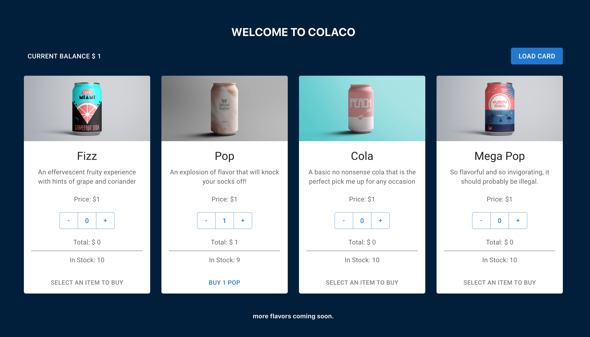

# Vending Machine App 

  

Simple vending machine mock application  
Full stack application built on MERN stack  
Customers can buy their favorite virtual soda in which they can get json file with all the cool information about their drink   
  
Admins can easily update their stock by accessing the admin page  
New products can be easily added as well  
Edit and Delete each product according to business needs  
   

For Future improvement  
Make use of payment API like stripe  
Add login page for the admins  

### Technologies used

FRONTEND  
React  
React Router  
Functional Components  
React Hooks  
Material UI    

BACKEND  
Express  
MongoDB  
Mongo Atlas  

### `npm install`

### In the vending-app project directory, you can run:

### `npm run start`

### Links 

API from DB: http://localhost:8000/api/products

### In the vending-machine project directory, you can run:

### `npm start`

For the front end: [http://localhost:3000](http://localhost:3000) to view it in your browser.  

